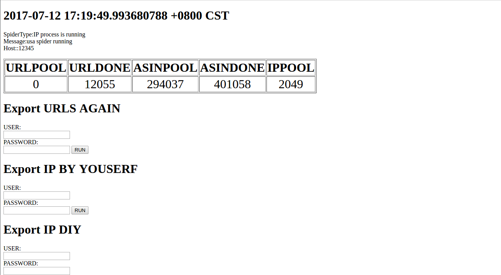
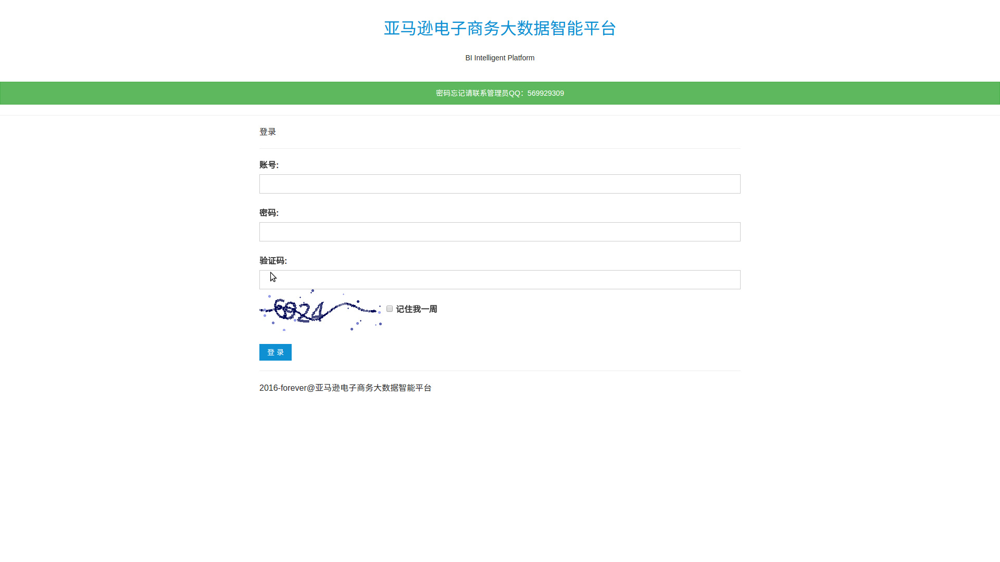
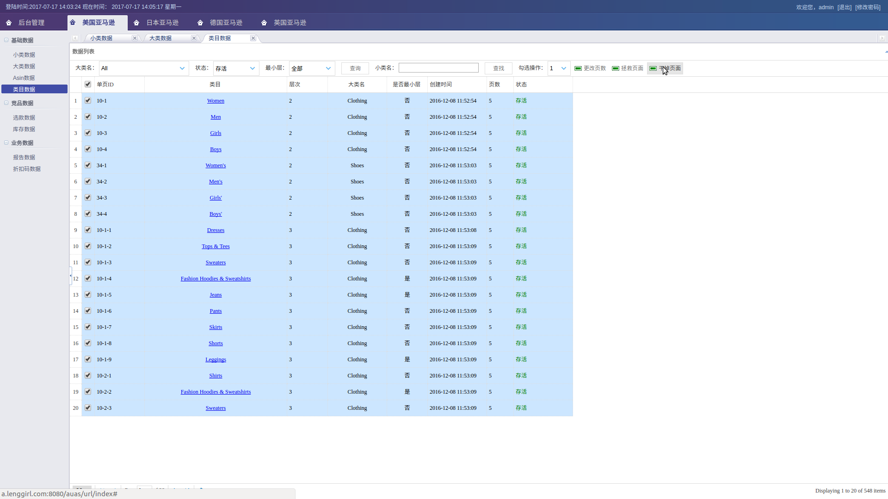
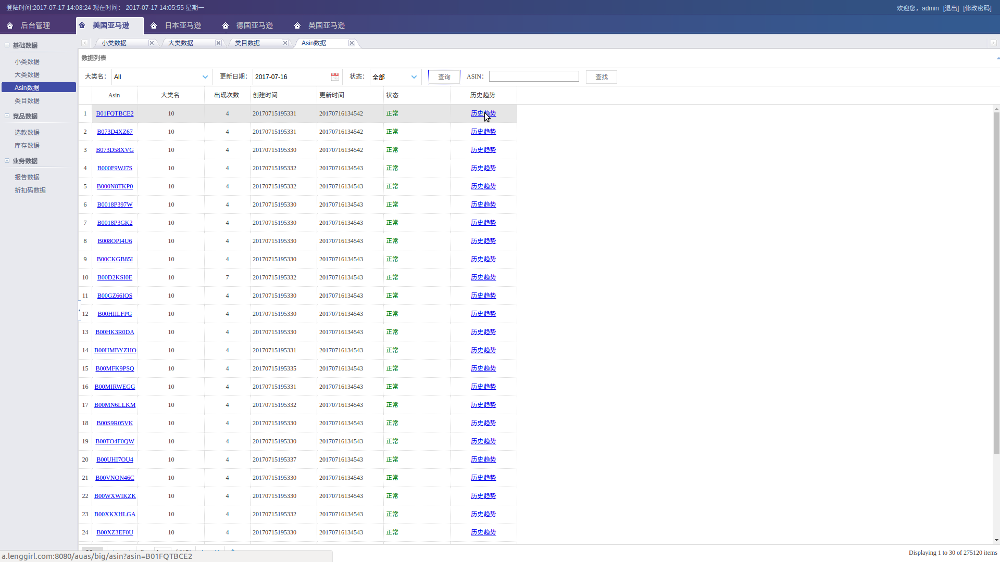
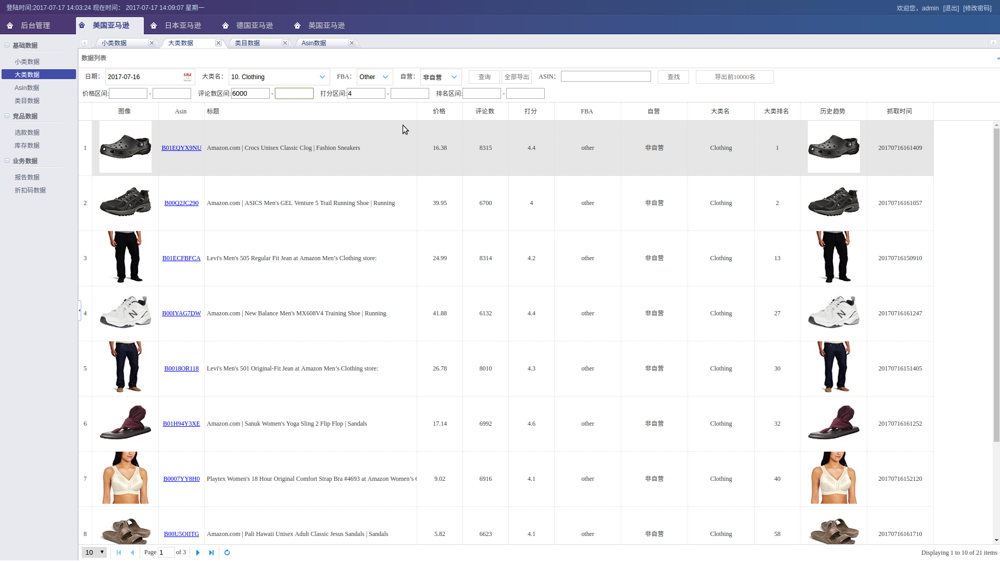
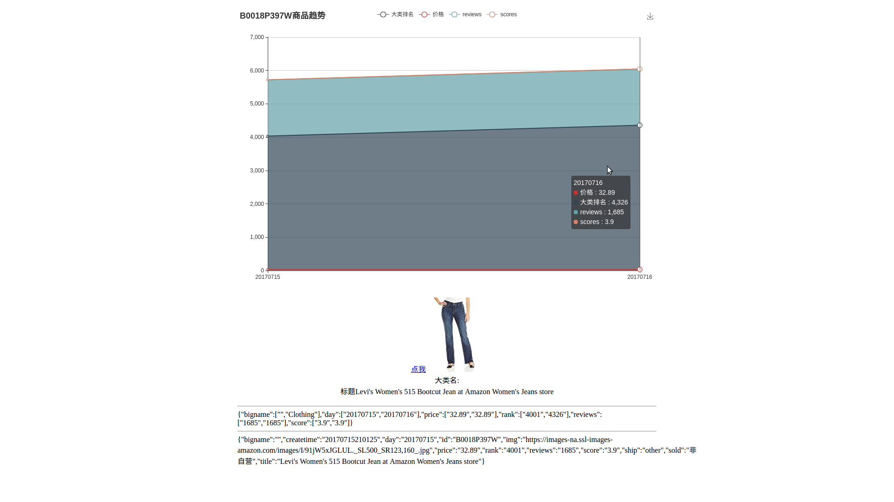
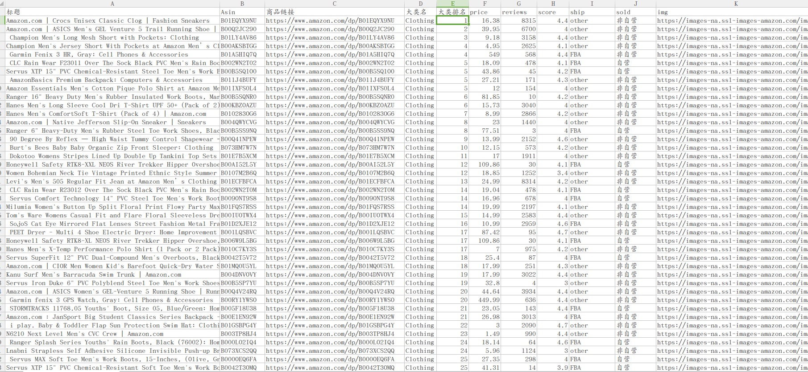

# Large Amazon Distributed Crawler

Support UAS/Japan/Germany/UK, Amazing!

Catch the best seller items in Amazon USA! Using redis to store proxy ip and the category url. First fetch items list and then collect many Asin, store in mysql. Items list catch just for the Asin, and we suggest one month or several weeks to fetch list page. We just need fetch the Asin detail page and everything we get!

We keep all Asin in one big table. And if catch detail 404, we set it as not valid. Also we can use API catch big rank but look not so good!

So, there are two ways to get the big rank：

1. catch list page(not proxy), using API get the big rank

2. catch list page(not proxy), and then get asin detail page(proxy), API can not catch all the asin big rank so must use this!

Due to we want list smallrank and the bigrank at the same time, but mysql update is so slow, we make two tables to save, one is smallrank, one is bigrank!

We test a lot,if a ip no stop and more than 500 times http get,the list page will no robot,but the detail asin page will be robot. So we bind a proxy ip with and fix useragent, and keep all cookie. But it still happen, a IP die still can fetch detail page after 26-100times get, It tell us we can still ignore robot, and catch max 100 times we will get that page. robot page is about 7KB.

However, if a lot of request, will be like that 500 error

For reason that the detail page is such large that waste a lot of disk space, we save the list page in the local file and the detail page you can decide whether to save it or not.

# 中文

本来开源于github，自从看了[为什么我的代码进入闭源状态](http://www.yinwang.org/blog-cn/2017/04/18/close-source)，以及被太多伸手党骚扰，后来删除

你仍然能够在github上找到，但是现在几乎跑不了，我大规模地改了模块，虽然闭源了(ง •̀_•́)ง，你仍然可以使用被别人fork的代码

开发者ID：`hunterhug`.  仓库：`AmazonBigSpider`

好了，现在你又可以看到了，鉴于搭建爬虫的复杂性，所以还是开源了，代码容易获得，但架设环境还是需要人工的，这也是成本！

Golang全自动亚马逊全网分布式爬虫（美国，日本，德国和英国）

架设八台代理服务器和三台爬虫服务器（美国机房），构建代理IP服务池模块和多爬虫切换模块，配合redis和mysql进行分布式高并发抓取日本/英国/美国/德国亚马逊商品数据，实现IP重蹈，爬虫监控，数据库主从到阿里云（读写分离）等功能，还配套Dashboard后台，方便筛选商品、下载excel和查看商品历史排名/价格等轨迹。爬虫crontab定时夜间开爬，代理IP自动循环导入。爬虫高度自动化，运维成本较低，每天有几百万数据产生。核心爬虫库抽离并开源！

亚马逊爬虫支持:

1. 列表页和详情页可选择代理方式
2. 多浏览器保存cookie机制
3. 机器人检测达到阈值自动换代理
4. 检测日期过期自动停止程序
5. IP池扫描周期填充代理IP
6. 支持分布式跨平台抓取
7. 高并发进程设置抓取
8. 默认网页爬取去重
9. 日志记录功能
10. 配套可视化网站，支持多角度查看数据，小类数据，大类数据，Asin数据和类目数据，支持查看每件Asin商品的历史记录，如排名，价格，打分，reviews变化。部分数据支持导出，且网站支持RBAC权限，可分配每部分数据的查看和使用权限。
11. 网络端监控爬虫，可查看爬虫当前时段数据抓取状态，爬取的进度，IP的消耗程度。   **可支持网络端启动和停止爬虫，彻底成为Saas**（待做）
12. 可自定义填入IP，如塞入其他代理IP网站API获取的IP
13. 可选择HTML文件保存本地

截图证明其存在过：

