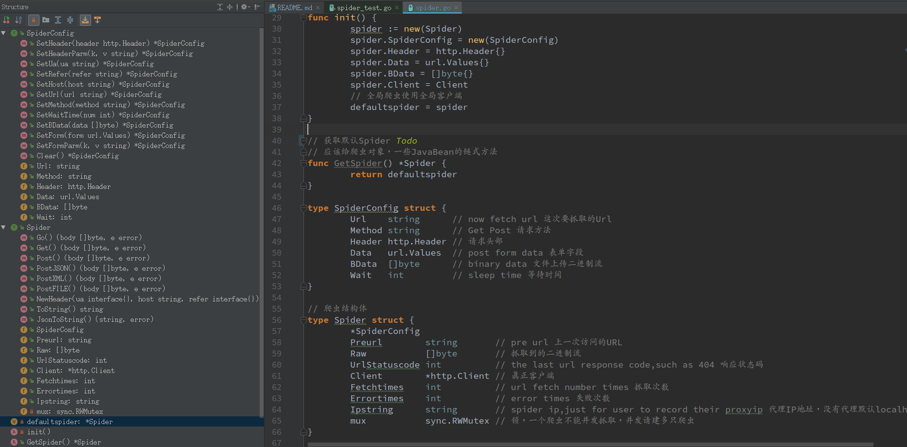

# 核心代码剖析

遇上JSON的响应，防止乱码，请使用util.JsonBack()

API使用请看具体示例，这里介绍两个爬虫对象,核心代码spider/spider.go里：

```
// 新建一个爬虫，如果ipstring是一个代理IP地址，那使用代理客户端
func NewSpider(ipstring interface{}) (*Spider, error) {
	spider := new(Spider)
	spider.SpiderConfig = new(SpiderConfig)
	spider.Header = http.Header{}
	spider.Data = url.Values{}
	spider.BData = []byte{}
	if ipstring != nil {
		client, err := NewProxyClient(ipstring.(string))
		spider.Client = client
		spider.Ipstring = ipstring.(string)
		return spider, err
	} else {
		client, err := NewClient()
		spider.Client = client
		spider.Ipstring = "localhost"
		return spider, err
	}

}
```

可以传入ipstring，表示使用代理，默认开启cookie记录，cookie会一直在内存中更新，默认有头部，如果要自定义http client客户端,使用：

下方的NewAPI是没有cookie的爬虫，主要用来对接API

```
// 通过官方Client来新建爬虫，方便您更灵活
func NewSpiderByClient(client *http.Client) *Spider {
	spider := new(Spider)
	spider.SpiderConfig = new(SpiderConfig)
	spider.Header = http.Header{}
	spider.Data = url.Values{}
	spider.BData = []byte{}
	spider.Client = client
	return spider
}


// API爬虫，不用保存Cookie，可用于对接各种API，但仍然有默认UA
func NewAPI() *Spider {
	return NewSpiderByClient(NoCookieClient)
}
```

官方的http.Client是这么用的，看spider/client.go

```
//cookie record
// 记录Cookie
func NewJar() *cookiejar.Jar {
	cookieJar, _ := cookiejar.New(nil)
	return cookieJar
}

var (
	//default client to ask get or post
	// 默认的官方客户端，带cookie,方便使用，没有超时时间，不带cookie的客户端不提供
	Client = &http.Client{
		CheckRedirect: func(req *http.Request, via []*http.Request) error {
			Logger.Debugf("-----------Redirect:%v------------", req.URL)
			return nil
		},
		Jar: NewJar(),
	}
	
	// 没有cookie的客户端
	NoCookieClient = &http.Client{
		CheckRedirect: func(req *http.Request, via []*http.Request) error {
			Logger.Debugf("-----------Redirect:%v------------", req.URL)
			return nil
		},
	}	
)
```

该客户端重定向打印日志，支持cookie持久，你也可以设置超时时间，代理，SSH等。。。。

更多API，参见



multspider.go是多只爬虫的API！参见代码

```
var (
	// 爬虫池子
	Pool = &_Spider{brower: make(map[string]*Spider)}
	Ua   = map[int]string{}
)

type _Spider struct {
	mux    sync.RWMutex
	brower map[string]*Spider
}

func (sb *_Spider) Get(name string) (b *Spider, ok bool) {
	sb.mux.RLock()
	b, ok = sb.brower[name]
	sb.mux.RUnlock()
	return
}

func (sb *_Spider) Set(name string, b *Spider) {
	sb.mux.Lock()
	sb.brower[name] = b
	sb.mux.Unlock()
	return
}

func (sb *_Spider) Delete(name string) {
	sb.mux.Lock()
	delete(sb.brower, name)
	sb.mux.Unlock()
	return
}

// Ua初始化
func UaInit() {
	Ua[0] = "Mozilla/5.0 (Windows NT 10.0; WOW64) AppleWebKit/537.36 (KHTML, like Gecko) Chrome/54.0.2840.71 Safari/537.36"
	temp, err := util.ReadfromFile(util.CurDir() + "/config/ua.txt")
	if err != nil {
		//panic(err.Error())
	} else {
		uas := strings.Split(string(temp), "\n")
		for i, ua := range uas {
			Ua[i] = strings.TrimSpace(strings.Replace(ua, "\r", "", -1))
		}
	}

}

// 返回随机Ua
func RandomUa() string {
	length := len(Ua)
	if length == 0 {
		return ""
	}
	return Ua[rand.Intn(length-1)]
}
```