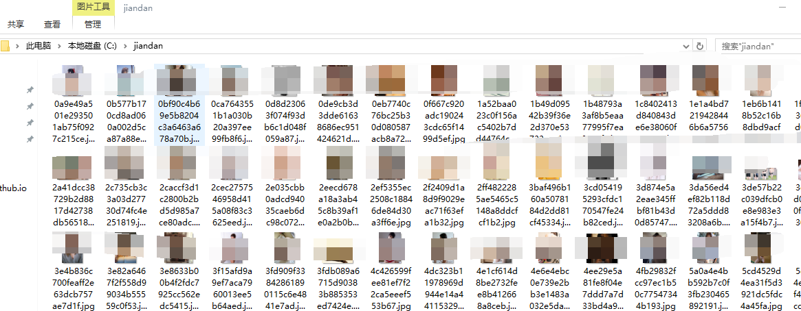

# 妹纸图下载

下载exe:[http://pan.baidu.com/s/1gfgi9YN](http://pan.baidu.com/s/1gfgi9YN)

网址类似于http://jandan.net/ooxx/page-3

首先进行配置
```
var (
	types = map[int]string{
		1: "ooxx", // 妹子图
		2: "pic",  // 无聊图
	}

	// 要抓哪一种
	Which = 1

	url     = "http://jandan.net/" + types[Which]
	urlpage = "http://jandan.net/" + types[Which] + "/page-%d"

	// 保存在统一文件
	saveroot = false
	// 根据页数保存在很多文件夹下
	savehash = true

	// 保存的地方
	rootdir = "D:\\jiandan\\jiandansum\\" + types[Which]
	// 根据页数分图片保存，不然图片太大了,我简称它hash（之前版本不是用page分而是hash）！
	// 图片太大硬盘会爆！
	hashdir = "D:\\jiandan\\jiandanpage\\" + types[Which]
)
```

`Which = 1`，1表示抓妹纸图，2表示无聊图

`saveroot`和`savehash`如果设置为真，那么会保存在相应的文件中

如上面所设置，文件不会保存在`D:\\jiandan\\jiandansum\\ooxx`，而是分散保存在`D:\\jiandan\\jiandanpage\\ooxx`文件夹下，按页数分。

运行`go run main.go`



已经封装成exe!请点击ooxx.exe抓取妹纸，wuliao.exe抓取无聊图，图片只能保存在D:\\jiandan